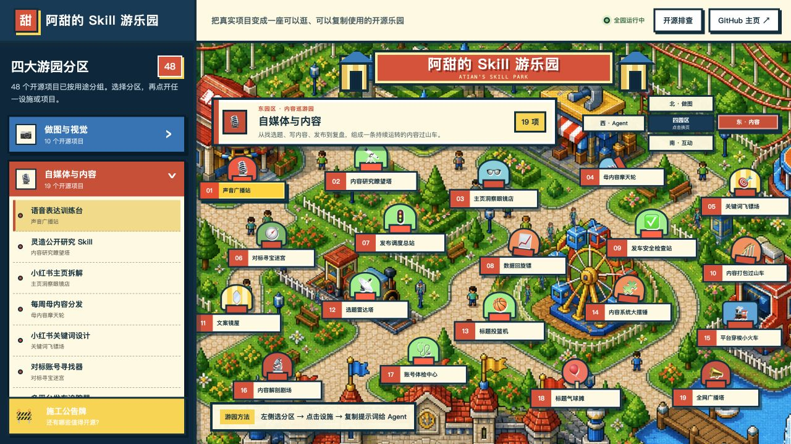

# A Tian's Skill Park

English · [简体中文](README.md)

A pixel-art amusement park that turns A Tian's real open-source Skills, websites, and interactive experiments into explorable attractions. Visitors can browse projects, open GitHub, and copy a ready-to-use prompt into an Agent.



## What it does

- Lists 48 verified public GitHub repositories across four switchable park pages: Visual North, Media East, Agent West, and Interactive South.
- Each district uses a different map direction and an organic attraction layout, with a distinct project mark and animated facility for every repository.
- Groups them into Visual Creation, Creator Content, Agent & Knowledge, and Interactive Websites & Games.
- Maps every project in the selected zone to a related animated amusement-park attraction.
- Provides a three-step tutorial, GitHub link, and Agent launch prompt for each project.
- Animates walking visitors, swan boats, rides, balloon stands, glasses shops, ice-cream carts, and other facilities.
- Includes an open-source audit board for future releases.

## Run locally

```bash
npm install
npm run dev
```

Build a server-free standalone HTML file:

```bash
npm run build:local
```

Then open `阿甜游乐园.html` directly.

## Copy into an Agent

```text
Please inspect and run this project: https://github.com/atian-create/atian-playground
Read the README and project structure first. Then show me how to add one real project, map it to a relevant amusement-park attraction, and verify the local build.
```

## Project principles

- Only real, finished, or already public projects are shown.
- Attraction metaphors must match project capabilities.
- Chinese UI copy is rendered in HTML instead of generated artwork.
- The project does not read or upload private local files.

## License

[MIT](LICENSE)
