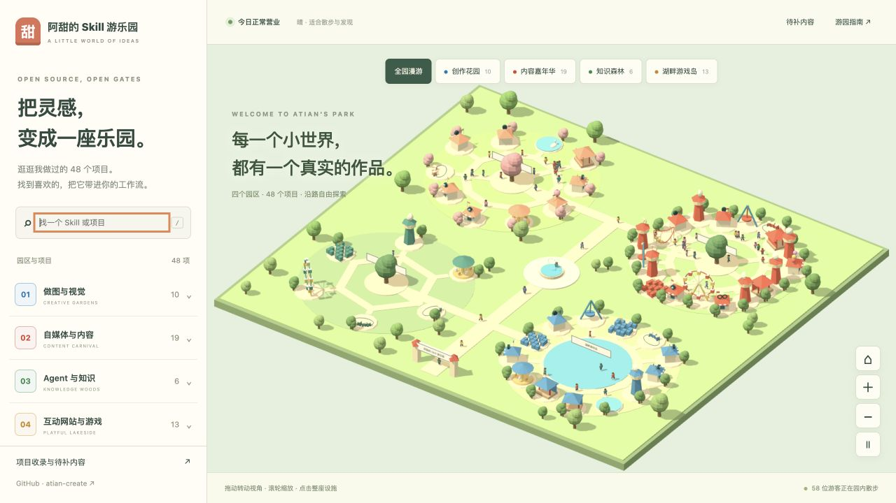
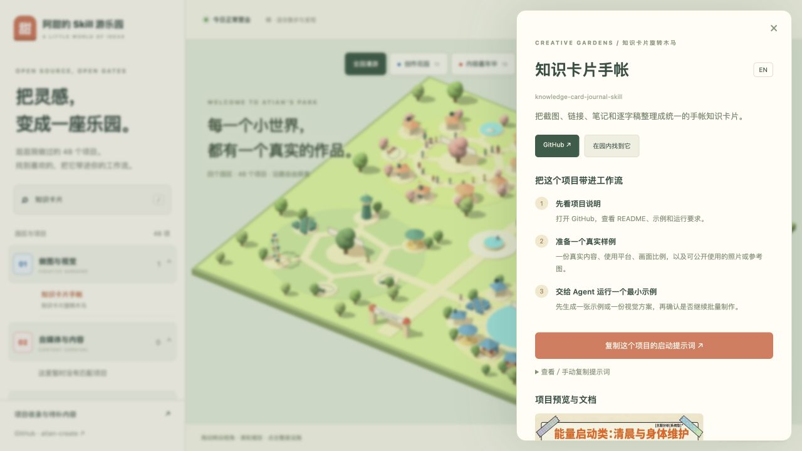

# A Tian's Skill Park

English · [简体中文](README.md)

A continuous 3D amusement park that turns A Tian's real open-source Skills, websites, and interactive experiments into explorable attractions. Visitors can browse projects, open GitHub, and copy a project-specific prompt into an Agent.

Visit [A Tian's Skill Park](https://atian-create.github.io/atian-playground/).



All four districts share one scene and connected paths. Switching districts moves the camera while the world keeps running. Drag to orbit, use the wheel or zoom buttons to get closer, and click the body of an attraction to open its project.

## What it does

- Lists 48 verified public GitHub repositories inside one park with four distinct environments: Creative Garden Street, Media Carnival, Knowledge Forest, and Lakeside Game Island.
- Every district has its own terrain, architecture, atmosphere, and organic attraction layout instead of reusing one map with a different title.
- Groups them into Visual Creation, Creator Content, Agent & Knowledge, and Interactive Websites & Games.
- Maps every project in the selected zone to a related animated amusement-park attraction.
- Provides a three-step tutorial, GitHub link, and Agent launch prompt for each project.
- Animates 58 solid 3D visitors with alternating legs, knee flexion, arm swing, torso weight shift, turns, and short stops. They share the same lighting, shadows, depth and paths as the park.
- Runs Ferris wheels with upright cabins, roller-coaster cars along 3D rails, bobbing carousels, pendulums, swan boats, trains and balloons.
- Includes search, pause, reduced-motion support and a usable project directory when WebGL cannot initialize.
- Provides a read-only public-repository audit with explicit documentation gaps instead of treating catalog inclusion as complete documentation.

## Illustrated walkthrough

1. Select a district or search for a project in the directory.
2. Click its building or project name and read the input requirements.
3. Copy the launch prompt into your Agent, or open the GitHub repository directly.
4. Use **Find in park** to move the camera to the attraction.



## Refresh the catalog audit

```bash
node scripts/audit-catalog.mjs
```

Requires an authenticated GitHub CLI. The read-only script checks public, non-fork repositories owned by atian-create and writes `src/data/catalog-audit.json`. On September 5, 2026, all 48 public repositories were included. 26 READMEs did not embed images, and 34 English-documentation checks require manual review. Filename and heading heuristics cannot prove that English content is absent.

## Model and simulation boundaries

The park uses procedural Three.js models, inspired by amusement-park management games. No complete model from the original RollerCoaster game is imported. Walking uses articulated procedural motion, not motion capture. Queueing, boarding rides, visitor-to-visitor avoidance, management simulation and original game save imports are not implemented. The directory remains usable without WebGL2.

## Run locally

```bash
npm install
npm run dev
```

Build a server-free standalone HTML file:

```bash
npm run build:local
```

Then open `阿甜游乐园.html` directly.

## Copy into an Agent

```text
Please inspect and run this project: https://github.com/atian-create/atian-playground
Read the README and project structure first. Then show me how to add one real project, map it to a relevant amusement-park attraction, and verify the local build.
```

## Project principles

- Only real, finished, or already public projects are shown.
- Attraction metaphors must match project capabilities.
- Chinese UI copy is rendered in HTML instead of generated artwork.
- The project does not read or upload private local files.

## License

[MIT](LICENSE)
